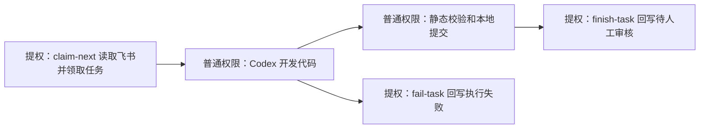

# 飞书多维表驱动的开发自动化流程

## 目标

通过飞书开放平台应用读取多维表里的需求和 BUG，自动完成任务领取、开发执行、本地提交、状态同步，并在人工审核通过后推送远程 `main`，可选自动部署到服务器。

## 多维表字段建议

| 字段 | 类型 | 用途 |
| --- | --- | --- |
| 标题 | 文本 | 任务标题 |
| 类型 | 单选 | `需求` / `BUG` / `优化` |
| 状态 | 单选 | 自动化状态机 |
| 优先级 | 单选 | 排序和人工判断 |
| 需求/BUG描述 | 多行文本 | Codex 执行任务的完整上下文 |
| 版本需求文档 | 文本或链接 | 养鸡庄园相关任务必须填写对应版本文档路径 |
| 目标分支 | 文本 | 默认 `main` |
| 执行结果 | 多行文本 | 自动化写入执行摘要或错误 |
| 本地提交 | 文本 | 自动化写入本地 commit hash |
| 远程推送 | 文本 | 自动化写入远程推送结果 |
| 部署结果 | 文本 | 可选字段；自动化写入服务器部署结果 |
| AI开始时间 | 日期时间 | 自动化领取任务并开始执行时写入 |
| AI结束时间 | 日期时间 | 自动化执行成功或失败时写入 |

## 多维表链接配置

如果多维表在飞书 wiki 里，可以直接配置 `wiki_url`：

```json
"feishu": {
  "app_id": "cli_xxx",
  "app_secret": "xxx",
  "wiki_url": "https://xxx.feishu.cn/wiki/xxx?table=tblxxx&view=vewxxx",
  "app_token": "",
  "table_id": "tblxxx",
  "view_id": ""
}
```

worker 会从 `wiki_url` 中解析：

- wiki 节点 token。
- `table_id`。
- `view_id`。
- 如果不想限制在某个视图，`view_id` 留空即可。

然后调用飞书开放平台 wiki 节点接口获取真正的多维表 `app_token`，再读写多维表记录。

## 状态机


建议把飞书多维表的 `状态` 字段设成单选，并固定这些选项，避免自动化读到拼写不同的状态。

## 自动化执行步骤

1. 获取飞书 `tenant_access_token`。
2. 查询多维表记录，筛选 `自动化状态 = 待处理`。
3. 领取任务：把记录状态改成 `开发中`。
4. 拼装任务提示词，包含标题、类型、描述、版本文档字段和仓库要求。
5. 执行配置里的开发命令。默认开发命令是 `codex exec`，也就是由 Codex AI 根据飞书需求修改本地仓库。
6. 运行配置里的静态校验命令。按你的约束，不启动本地服务测试。
7. 提交到本地 `main`。
8. 写回飞书：`状态 = 待人工审核`，并把 Codex 输出、静态校验结果、本地 Git 记录和 commit hash 汇总到 `执行结果`，方便人工审核。
9. 等待人工审核。人工确认后，把飞书状态改成 `审核通过`。
10. 推送远程：自动化只推送 `审核通过` 的记录。
11. 如果开启 `deployment.enabled`，自动执行部署命令；默认策略是 SSH 到服务器执行 Docker Compose 部署。
12. 写回飞书：`状态 = 已推送`，并记录远程推送和部署结果。

## 养鸡庄园专项约束

如果任务属于养鸡庄园的需求、BUG 修复或优化，执行提示词里会强制包含：

- 代码修改后必须更新对应版本需求文档。
- 可以本地跑静态校验。
- 不要本地跑服务测试。
- 代码改完后先提交到本地 `main`。
- 人工审核通过后才推送远程 `main`。

## 权限和安全

- 飞书 `app_id` 和 `app_secret` 放在本地配置 `config/feishu_automation.local.json`。
- 不要把 `config/*.local.json` 提交到仓库。
- 推送远程前以飞书状态 `审核通过` 作为人工闸门。
- 自动部署只发生在远程推送成功后；部署失败会回写 `执行失败`，并把失败原因写入部署结果或远程推送字段。
- 建议飞书应用只开放目标多维表所需权限。

## 推荐运行方式

可以用系统计划任务、CI runner、自托管 runner 或 Codex 定时自动化触发：

- `--mode list`：只读检查任务。
- `--mode execute`：领取并执行 `待处理` 任务。
- `--mode push-approved`：推送人工审核通过的任务。
- 如果 `deployment.enabled=true`，`push-approved` 会在推送成功后继续自动部署服务器。
- `--mode watch`：常驻后台 worker，定时读取飞书并自动执行。
- `--mode claim-next`：只读取/领取一条飞书任务，输出给 Codex 开发。
- `--mode finish-task`：开发成功后回写飞书。
- `--mode fail-task`：开发失败后回写飞书。
其中 `watch` 会按配置处理任务；默认同一目标仓库串行执行，避免多个任务同时改同一个本地 `main` 导致提交归属混乱。

生产环境建议拆成两个定时任务：

- 每 10 到 30 分钟运行一次 `execute`。
- 每 5 到 10 分钟运行一次 `push-approved`；开启部署后，这一步也负责上线。
- 或者直接常驻运行 `watch`。

如果不想在本地开 cmd 常驻，可以使用 Codex 定时自动化来定时执行同一个流程。建议让自动化在仓库目录里周期性运行 `execute` 和 `push-approved`；飞书表仍然负责人工审核闸门，服务器部署由 `deployment` 配置控制。

如果要把提权范围限制在飞书 API，推荐 Codex 自动化使用拆分流程：



只有 `claim-next`、`finish-task`、`fail-task` 需要联网访问飞书。代码开发、静态校验、Git 提交不提权。

## 飞书原生面板

不用额外做本地动态页面。飞书多维表负责所有可视化和人工操作，后台 worker 只负责读取任务、调用 Codex、回写状态。

建议在飞书里建这些视图：

- `任务总览`：表格视图，展示标题、类型、状态、优先级、版本需求文档、执行结果、本地提交、远程推送。
- `状态看板`：看板视图，按 `状态` 分组，直接拖动或查看任务流转。
- `待处理队列`：筛选 `状态 = 待处理`。
- `开发中`：筛选 `状态 = 开发中`。
- `待审核`：筛选 `状态 = 待人工审核`，人工审核后把状态改成 `审核通过`。
- `失败任务`：筛选 `状态 = 执行失败`，重点看 `执行结果` 字段。
- `版本进度`：按版本字段或 `版本需求文档` 分组，用于养鸡庄园版本需求追踪。

如果使用飞书多维表仪表盘，可以添加：

- 状态数量统计。
- 类型分布统计。
- 优先级分布统计。
- 待审核列表。
- 执行失败列表。

后台常驻 worker：

```powershell
python scripts/feishu_task_runner.py --config config/feishu_automation.local.json --mode watch
```

配置项：
`automation.parallel_mode` 控制是否启用多任务模式：

- `serial`：默认值。同一目标仓库串行执行，避免多个 Codex 任务共享同一个工作区。
- `worktree`：每个任务使用独立的 git worktree 和本地任务分支，可同时开发多个任务；任务分支只保留在本地，不会推送到远程仓库。

`automation.max_parallel_tasks` 默认 1，最大 3，限制同一时间最多并行处理的任务数。`worktree_dir` 可以指定 worktree 存放目录；留空时默认放在目标仓库同级目录的 `<仓库名>-worktrees/` 下。

```json
"automation": {
  "poll_interval_seconds": 60,
  "max_parallel_tasks": 3,
  "parallel_mode": "worktree",
  "worktree_dir": "C:/path/to/repo-worktrees",
  "allow_parallel_same_repo": false,
  "execute_pending": true,
  "push_approved": true
},
"logging": {
  "enabled": true,
  "file_enabled": true,
  "file_path": "logs/feishu-runner.log",
  "verbose": false,
  "command_output": false
}
```

### 多任务模式（worktree）

启用 `parallel_mode=worktree` 后，worker 领取任务时会为每条记录创建：

- 本地分支：`feishu/<record_id>`
- 独立 worktree：`<worktree_dir>/<record_id>`

流程如下：

1. 领取任务时，基于当时本地 `main` 的 HEAD 创建 worktree 和任务分支。
2. Codex 在对应 worktree 里开发，静态校验也在该 worktree 里运行。
3. Codex 把改动提交到本地任务分支，不切换分支，不推送远程。
4. 任务开发完成后，runner 在本地 `main` 上加锁串行合并 `feishu/<record_id>`。
5. 合并成功后，runner 把任务摘要追加到飞书记录里填写的版本需求文档，例如 `docs/requirements/0.2.1.md`，再单独提交到本地 `main`。
6. 飞书写回 `待人工审核`，记录的 `本地提交` 是本地 `main` 上合并后的最终 commit。
7. 人工审核通过后，只推送本地 `main`；任务分支和 worktree 在推送完成并写回 `已推送` 后自动清理。

合并遇到冲突时，runner 会中止合并，把任务标记为 `执行失败`，并在错误信息里列出冲突文件；worktree 和任务分支会保留，方便人工解决后通过 `retry-failed` 只重试合并。

worker 会按 `poll_interval_seconds` 定时拉飞书：

- 发现 `待处理` 时，调用 `codex exec` 领取并开发。
- `待需求审核` 不会被 AI 执行，需要人工确认后改成 `待处理`。
- worktree 模式下任务分支合并到本地 `main` 后，写回 `待人工审核`。
- 人工把飞书状态改成 `审核通过` 后，自动推送远程 `main` 并写回 `已推送`。
- 如果开启部署，推送成功后会自动部署服务器，并写回 `部署结果`；没有该字段时会写入 `远程推送`。
- 每条任务必须产生相对领取时 `base_commit` 的新本地提交；没有新提交会进入 `执行失败`，不会复用当前 HEAD。
- 推送前会校验所有 `审核通过` 记录的 `本地提交`：为空、重复、本地不存在或不在本地 `main` 上的 commit 都会阻止推送。
- worktree 模式下的 `feishu/*` 任务分支只创建在本地，任何流程都不会推送任务分支到远程仓库。
- worker 领取任务时写入 `AI开始时间`。
- worker 执行成功或失败时写入 `AI结束时间`。
- `logging.enabled` 控制控制台中文运行日志。
- `logging.file_enabled` 控制是否把 runner 自身日志写入文件。
- `logging.file_path` 控制日志文件路径；留空时默认写入 `logs/feishu-runner.log`。
- `logging.verbose` 控制是否输出每轮 token、字段、记录读取等详细轮询日志；默认关闭，只保留关键事件。
- `logging.command_output` 控制是否打印 Codex、静态校验和 Git push 的命令输出，调试时建议打开。

`state/tasks/*.json` 只保留 Codex、静态校验等长输出的摘要，避免状态文件膨胀到难以阅读；完整审核摘要仍会回写到飞书 `执行结果` 字段。

## 表结构自动识别

只读检查当前表结构：

```powershell
python scripts/feishu_task_runner.py --config config/feishu_automation.local.json --mode inspect-schema
```

自动补齐缺失字段：

```powershell
python scripts/feishu_task_runner.py --config config/feishu_automation.local.json --mode sync-schema
```

字段自动匹配规则包括：

- `任务`、`任务标题`、`需求标题` -> 标题。
- `需求描述`、`描述`、`详情` -> 需求/BUG描述。
- `版本`、`版本文档` -> 版本需求文档。
- `优先级`、`优先度` -> 优先级。

如果原表已经有业务状态字段，建议配置独立的自动化状态字段：

```json
"schema": {
  "automation_status_field": "自动化状态",
  "cache_path": "state/feishu_schema_cache.json"
}
```

第一次执行 `list`、`execute`、`push-approved`、`claim-next`、`finish-task` 或 `fail-task` 时，脚本会读取一次飞书字段结构并把匹配好的字段和状态写入 `schema.cache_path`。后续定时执行会直接复用本地缓存，不再每轮扫描字段；如果你改了飞书表结构，重新运行 `--mode sync-schema` 即可刷新缓存。

这样原有 `状态` 字段可以继续表达业务含义，`自动化状态` 专门用于：

- `待需求审核`
- `待处理`
- `开发中`
- `待人工审核`
- `审核通过`
- `已推送`
- `执行失败`

可选字段 `部署结果` 不会阻断老表运行；执行 `--mode sync-schema` 时会自动补齐。

## 自动部署配置

部署默认关闭。开启后，`push-approved` 会先推送远程 `main`，再执行部署，最后回写飞书。

默认 Docker 部署：

```json
"deployment": {
  "enabled": true,
  "strategy": "docker",
  "timeout_seconds": 1800,
  "docker": {
    "host": "deploy@example.com",
    "ssh_port": 22,
    "identity_file": "",
    "repo_path": "/srv/your-app",
    "compose_command": ["docker", "compose"],
    "compose_file": "docker-compose.yml",
    "project_name": "",
    "services": [],
    "pull_before_up": false,
    "build": true,
    "remove_orphans": true
  }
}
```

默认生成的服务器命令会通过 SSH 执行：

```bash
cd /srv/your-app
git fetch origin main
git checkout main
git pull --ff-only origin main
docker compose -f docker-compose.yml up -d --build --remove-orphans
```

如果服务器需要先拉镜像，把 `pull_before_up` 改成 `true`。如果只部署部分服务，在 `services` 里写服务名数组。

自定义单条部署命令：

```json
"deployment": {
  "enabled": true,
  "command": "ssh deploy@example.com \"cd /srv/your-app && ./deploy.sh\""
}
```

自定义多步部署命令：

```json
"deployment": {
  "enabled": true,
  "commands": [
    "ssh deploy@example.com \"cd /srv/your-app && git pull --ff-only origin main\"",
    "ssh deploy@example.com \"cd /srv/your-app && docker compose up -d --build\""
  ]
}
```

`command` 支持字符串，也支持参数数组；`commands` 表示命令序列。可用占位符包括 `{repo_path}`、`{remote}`、`{branch}`、`{main_branch}`、`{pushed_commits}`。

## Codex AI 配置

`runner.development_command` 可以直接调用 Codex CLI：

```json
[
  "codex",
  "--ask-for-approval",
  "never",
  "--sandbox",
  "workspace-write",
  "--cd",
  "{repo_path}",
  "exec",
  "-"
]
```

脚本会在运行前规范化 Codex 数组命令：`--ask-for-approval never`、`--sandbox workspace-write` 和 `--cd {repo_path}` 会放在 `exec` 前面；如果旧配置缺少可写沙箱或写成 `read-only`，会自动改为 `workspace-write`。

占位符说明：

- `{repo_path}`：自动替换为目标仓库路径。
- `{task_prompt}`：自动替换为从飞书任务拼出来的完整需求提示词。

默认命令最后的 `-` 表示从 stdin 读取需求，适合飞书描述较长的任务。如果你更想在命令参数里显式传 prompt，也可以把 `-` 改成 `{task_prompt}`。

默认使用当前 Codex CLI 的登录态和模型配置。如果自动化跑在计划任务或独立 runner 里，需要确保那个运行用户已经执行过 `codex login`，或者能访问同一个 `CODEX_HOME`。

## 本地提交方式

`runner.commit_after_development` 控制是否由自动化脚本负责本地提交：

```json
"runner": {
  "commit_after_development": true
}
```

- `true`：默认行为。Codex 修改和静态校验完成后，runner 会执行 `git add -A` 和 `git commit`，然后把提交号回写飞书。
- `false`：runner 不执行 `git add` / `git commit`，只读取当前 `HEAD` 和本地 Git 记录并回写飞书。适合已经要求 AI 会话自己完成本地提交的场景。

当 `commit_after_development=false` 时，runner 会要求目标仓库工作区是干净的；如果 AI 只改了代码但没有提交，任务会失败并提示需要让 AI 提交，避免未提交代码被误标为“待人工审核”。

这个配置只影响“本地提交”阶段，不影响“审核通过后推送远程”。远程推送仍然由 `automation.push_approved` 或手动 `--mode push-approved` 控制，只处理飞书状态为 `审核通过` 的记录。

如果 `commit_after_development=false` 但 Codex 开发结束后仍有未提交改动，runner 会先尝试接着刚刚的 Codex 会话补发一次“只完成本地提交”的指令；补提交后工作区仍不干净时才会失败。

## 图片附件

`runner.include_images` 控制是否把飞书图片附件传给 Codex：

```json
"runner": {
  "include_images": true,
  "image_fields": []
}
```

- `include_images=true`：默认开启。领取任务时会下载飞书记录中的图片附件，并给 Codex CLI 追加 `--image <path>`。
- `image_fields=[]`：自动扫描所有附件字段，只处理 `image/*` 图片。
- `image_fields=["图片"]`：只扫描指定字段，适合表里有多个附件字段但只有部分需要给 AI 的场景。

图片会缓存到 `state/attachments/<record_id>/`，任务 state 会记录 `image_paths`。失败重试或继续会话时，会复用这些本地图片路径。
