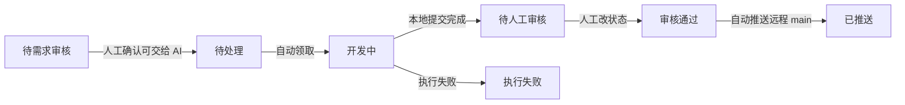
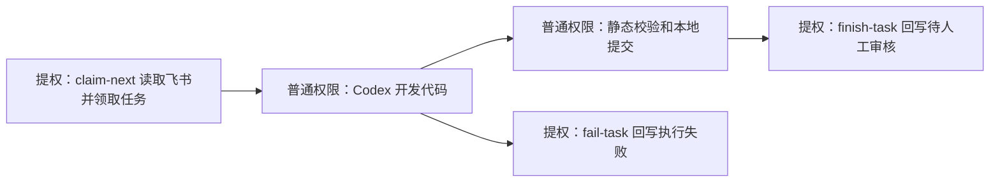

# 飞书多维表驱动的开发自动化流程

## 目标

通过飞书开放平台应用读取多维表里的需求和 BUG，自动完成任务领取、开发执行、本地提交、状态同步，并在人工审核通过后推送远程 `main`。

## 多维表字段建议

| 字段 | 类型 | 用途 |
| --- | --- | --- |
| 标题 | 文本 | 任务标题 |
| 类型 | 单选 | `需求` / `BUG` / `优化` |
| 状态 | 单选 | 自动化状态机 |
| 优先级 | 单选 | 排序和人工判断 |
| 需求/BUG描述 | 多行文本 | Codex 执行任务的完整上下文 |
| 版本需求文档 | 文本或链接 | 养鸡庄园相关任务必须填写对应版本文档路径 |
| 目标分支 | 文本 | 默认 `main` |
| 执行结果 | 多行文本 | 自动化写入执行摘要或错误 |
| 本地提交 | 文本 | 自动化写入本地 commit hash |
| 远程推送 | 文本 | 自动化写入远程推送结果 |
| AI开始时间 | 日期时间 | 自动化领取任务并开始执行时写入 |
| AI结束时间 | 日期时间 | 自动化执行成功或失败时写入 |

## 多维表链接配置

如果多维表在飞书 wiki 里，可以直接配置 `wiki_url`：

```json
"feishu": {
  "app_id": "cli_xxx",
  "app_secret": "xxx",
  "wiki_url": "https://xxx.feishu.cn/wiki/xxx?table=tblxxx&view=vewxxx",
  "app_token": "",
  "table_id": "tblxxx",
  "view_id": ""
}
```

worker 会从 `wiki_url` 中解析：

- wiki 节点 token。
- `table_id`。
- `view_id`。
- 如果不想限制在某个视图，`view_id` 留空即可。

然后调用飞书开放平台 wiki 节点接口获取真正的多维表 `app_token`，再读写多维表记录。

## 状态机



建议把飞书多维表的 `状态` 字段设成单选，并固定这些选项，避免自动化读到拼写不同的状态。

## 自动化执行步骤

1. 获取飞书 `tenant_access_token`。
2. 查询多维表记录，筛选 `自动化状态 = 待处理`。
3. 领取任务：把记录状态改成 `开发中`。
4. 拼装任务提示词，包含标题、类型、描述、版本文档字段和仓库要求。
5. 执行配置里的开发命令。默认开发命令是 `codex exec`，也就是由 Codex AI 根据飞书需求修改本地仓库。
6. 运行配置里的静态校验命令。按你的约束，不启动本地服务测试。
7. 提交到本地 `main`。
8. 写回飞书：`状态 = 待人工审核`，并记录 commit hash。
9. 等待人工审核。人工确认后，把飞书状态改成 `审核通过`。
10. 推送远程：自动化只推送 `审核通过` 的记录。
11. 写回飞书：`状态 = 已推送`。

## 养鸡庄园专项约束

如果任务属于养鸡庄园的需求、BUG 修复或优化，执行提示词里会强制包含：

- 代码修改后必须更新对应版本需求文档。
- 可以本地跑静态校验。
- 不要本地跑服务测试。
- 代码改完后先提交到本地 `main`。
- 人工审核通过后才推送远程 `main`。

## 权限和安全

- 飞书 `app_id` 和 `app_secret` 放在本地配置 `config/feishu_automation.local.json`。
- 不要把 `config/*.local.json` 提交到仓库。
- 推送远程前以飞书状态 `审核通过` 作为人工闸门。
- 建议飞书应用只开放目标多维表所需权限。

## 推荐运行方式

可以用系统计划任务、CI runner、自托管 runner 或 Codex 定时自动化触发：

- `--mode list`：只读检查任务。
- `--mode execute`：领取并执行 `待处理` 任务。
- `--mode push-approved`：推送人工审核通过的任务。
- `--mode watch`：常驻后台 worker，定时读取飞书并自动执行。
- `--mode claim-next`：只读取/领取一条飞书任务，输出给 Codex 开发。
- `--mode finish-task`：开发成功后回写飞书。
- `--mode fail-task`：开发失败后回写飞书。
其中 `watch` 会按配置并发处理任务，默认最多同时跑 3 个需求或 BUG。

生产环境建议拆成两个定时任务：

- 每 10 到 30 分钟运行一次 `execute`。
- 每 5 到 10 分钟运行一次 `push-approved`。
- 或者直接常驻运行 `watch`。

如果要把提权范围限制在飞书 API，推荐 Codex 自动化使用拆分流程：



只有 `claim-next`、`finish-task`、`fail-task` 需要联网访问飞书。代码开发、静态校验、Git 提交不提权。

## 飞书原生面板

不用额外做本地动态页面。飞书多维表负责所有可视化和人工操作，后台 worker 只负责读取任务、调用 Codex、回写状态。

建议在飞书里建这些视图：

- `任务总览`：表格视图，展示标题、类型、状态、优先级、版本需求文档、执行结果、本地提交、远程推送。
- `状态看板`：看板视图，按 `状态` 分组，直接拖动或查看任务流转。
- `待处理队列`：筛选 `状态 = 待处理`。
- `开发中`：筛选 `状态 = 开发中`。
- `待审核`：筛选 `状态 = 待人工审核`，人工审核后把状态改成 `审核通过`。
- `失败任务`：筛选 `状态 = 执行失败`，重点看 `执行结果` 字段。
- `版本进度`：按版本字段或 `版本需求文档` 分组，用于养鸡庄园版本需求追踪。

如果使用飞书多维表仪表盘，可以添加：

- 状态数量统计。
- 类型分布统计。
- 优先级分布统计。
- 待审核列表。
- 执行失败列表。

后台常驻 worker：

```powershell
python scripts/feishu_task_runner.py --config config/feishu_automation.local.json --mode watch
```

配置项：
`automation.max_parallel_tasks` 默认 3，用来限制同一时间最多并行处理的任务数。

```json
"automation": {
  "poll_interval_seconds": 60,
  "execute_pending": true,
  "push_approved": true
},
"logging": {
  "enabled": true,
  "command_output": false
}
```

worker 会按 `poll_interval_seconds` 定时拉飞书：

- 发现 `待处理` 时，调用 `codex exec` 领取并开发。
- `待需求审核` 不会被 AI 执行，需要人工确认后改成 `待处理`。
- 本地提交完成后，写回 `待人工审核`。
- 人工把飞书状态改成 `审核通过` 后，自动推送远程 `main` 并写回 `已推送`。
- worker 领取任务时写入 `AI开始时间`。
- worker 执行成功或失败时写入 `AI结束时间`。
- `logging.enabled` 控制中文运行日志。
- `logging.command_output` 控制是否打印 Codex、静态校验和 Git push 的命令输出，调试时建议打开。

## 表结构自动识别

只读检查当前表结构：

```powershell
python scripts/feishu_task_runner.py --config config/feishu_automation.local.json --mode inspect-schema
```

自动补齐缺失字段：

```powershell
python scripts/feishu_task_runner.py --config config/feishu_automation.local.json --mode sync-schema
```

字段自动匹配规则包括：

- `任务`、`任务标题`、`需求标题` -> 标题。
- `需求描述`、`描述`、`详情` -> 需求/BUG描述。
- `版本`、`版本文档` -> 版本需求文档。
- `优先级`、`优先度` -> 优先级。

如果原表已经有业务状态字段，建议配置独立的自动化状态字段：

```json
"schema": {
  "automation_status_field": "自动化状态"
}
```

这样原有 `状态` 字段可以继续表达业务含义，`自动化状态` 专门用于：

- `待需求审核`
- `待处理`
- `开发中`
- `待人工审核`
- `审核通过`
- `已推送`
- `执行失败`

## Codex AI 配置

`runner.development_command` 可以直接调用 Codex CLI：

```json
[
  "codex",
  "exec",
  "--ask-for-approval",
  "never",
  "--sandbox",
  "workspace-write",
  "--cd",
  "{repo_path}",
  "-"
]
```

占位符说明：

- `{repo_path}`：自动替换为目标仓库路径。
- `{task_prompt}`：自动替换为从飞书任务拼出来的完整需求提示词。

默认命令最后的 `-` 表示从 stdin 读取需求，适合飞书描述较长的任务。如果你更想在命令参数里显式传 prompt，也可以把 `-` 改成 `{task_prompt}`。

默认使用当前 Codex CLI 的登录态和模型配置。如果自动化跑在计划任务或独立 runner 里，需要确保那个运行用户已经执行过 `codex login`，或者能访问同一个 `CODEX_HOME`。
